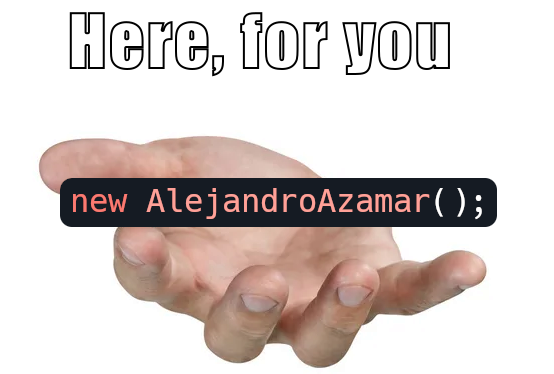

<div align="center">
  
</div>

```js
export class AlejandroAzamar {
    constructor() {
        this.name = 'Alejandro Azamar';
        this.role = 'Software Engineer — backend-focused';
        this.languages = { spanish: 'C2', english: 'B2' };

        this.tech = [ 'PostgreSQL', 'MySQL', 'Firebase', Express',
            'FastAPI', 'Kotlin', 'Ruby on Rails', 'Laravel',
        ];

        this.recentProject = {
            title: 'University of Colima Repository (ReUC)',
            backendSummary:
            'Layered architecture (Presentation/Domain/Application/Infra) → PostgreSQL → Prisma ORM → Node/Express REST API with JWT auth, input validation, CORS and centralized error handling. CI: GitHub Actions for PR checks.',
            responsibilities: [
                'Requirements & scope with client',
                'Architecture management',
                'Relational model & query-oriented design',
                'Secure REST API (JWT + validation)',
                'CI for PR quality checks'
            ]
        };

        this.courses = [
            'Advanced Databases',
            'Data Structures',
            'Operating Systems',
            'Software Development Life Cycle',
            'Software Quality Control'
        ];

        this.contactInfo = {
            email: 'alex.jeraza@gmail.com',
            linkedin: 'linkedin.com/in/zama15',
        };
    }

    summary() {
        return `${this.name} — ${this.role}. Backend focus: Database management, REST API management.`;
    }

    projectDetails() {
        return {
            title: this.recentProject.title,
            backendHighlights: this.recentProject.responsibilities,
            short: this.recentProject.backendSummary
        };
    }

    techStack() {
        return this.tech.join(', ');
    }

    contact() {
        return this.contactInfo;
    }

    toJSON() {
        return {
            name: this.name,
            role: this.role,
            languages: this.languages,
            tech: this.tech,
            recentProject: this.recentProject.title,
            courses: this.courses,
            contact: this.contactInfo
        };
    }
}
```
